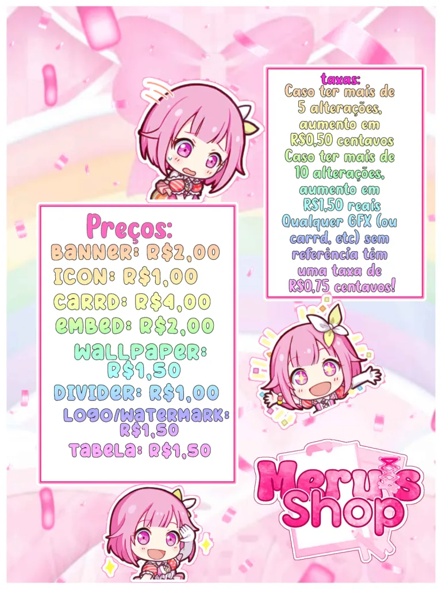

## Olá! Bem vindo(a) ao README da Meru! (⁠─⁠.⁠─⁠|⁠|⁠）

**meruismissing** na verdade é uma pessoa! E ela se chama Melissa! Ela tem uma grande personalidade e quer aprender a codar (ela vai editar isso quando estiver aprendendo **mesmo**)

๑ Algumas coisas sobre mim

ㆍ🌈  ㆍ— — — — — — — — —
- ꒰ 💗 ꒱ 　No momento, sou estudante!
- ꒰ 🩷 ꒱ 　Vou aprender Python!
- ꒰ ❤️ ꒱ 　Eu gostaria de criar um **site**!
- ꒰ 🧡 ꒱ 　Eu pretendo trabalhar com programação no futuro.
- ꒰ 💛 ꒱ 　Me pergunte sobre: jogos, filmes, qualquer coisa na verdade.
- ꒰ 💚 ꒱ 　Meus jogos favoritos são: Red Dead Redemption 2, Undertale, ENA Dream BBQ, Fortnite e GTA V!
- ꒰ 🩵 ꒱ 　Eu uso qualquer pronome (exceto neutro)　
- ꒰ 💙 ꒱ 　Um fato curioso: sou uma pessoa bem difícil de lidar sob pressão, mas dou meu melhor para ser produtiva. [﹒๑drive de exemplos๑﹒](https://drive.google.com/drive/folders/179rKn8_EBwZFB8gA9IvbqxRhCawP9afa)
 — — — — — — — — —ㆍ❄️  ㆍ

 ---
  
 

  

 ---

| Projetos atuais  | Quantia investida |
| ------------- | ------------- |
| Meru's Shop  | Gastos R$12,00 estimadamente  |
| Dotterice  | Ganhei R$7,00  |

---

### 📊 GitHub Stats

  

